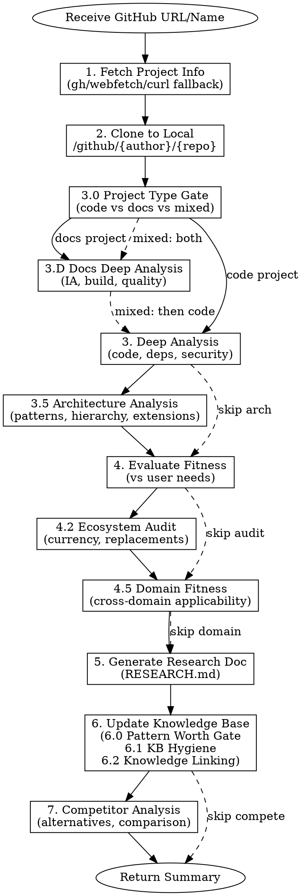

# GitHub Project Researcher — Full Reference

> **This is the full reference version.** The compact version loaded by default is `SKILL.md`.
> Read this file on-demand for detailed bash commands, templates, and language-specific examples.

Self-evolving GitHub project research agent. Analyze projects, find vulnerabilities, evaluate fitness, **understand architecture**, **assess cross-domain applicability**, **compare competitors**, clone to local library, generate documentation.

**Clone Directory:** `$CLONE_BASE/{author}/{repo}` (default: `~/.github-researcher/projects/{author}/{repo}`)
**Log Directory:** `$LOG_BASE/{owner}_{repo}_{timestamp}` (default: `~/.github-researcher/logs/{owner}_{repo}_{timestamp}`)

## Configuration

Set these environment variables before use (or rely on defaults):

| Variable | Default | Description |
|----------|---------|-------------|
| `CLONE_BASE` | `~/.github-researcher/projects` | Where researched projects are cloned |
| `LOG_BASE` | `~/.github-researcher/logs` | Where session logs are saved |

## Default Behavior

当用户说"研究 xxx"或"Research xxx"时，默认使用以下命令：

```bash
./research.sh <github_url> --async --log --verbose
```

**选项说明：**
- `--async` — 异步模式，不阻塞终端
- `--log` — 保存完整会话日志到日志目录
- `--verbose` — 显示实时研究进度消息

**日志位置：** `$LOG_BASE/{owner}_{repo}_{timestamp}/SESSION.md`

## When to Use

- Research a GitHub project's capabilities and use cases
- **Analyze project architecture and design patterns** (Step 3.5)
- **Analyze documentation-first projects** (guides, tutorials) (Step 3.D)
- Find security vulnerabilities or code quality issues
- Evaluate if a project fits specific needs
- **Audit if recommendations/tooling are still current** (Step 4.2)
- **Assess project fitness for a DIFFERENT domain** (Step 4.5)
- **Find and compare alternative/competitor projects** (Step 7)
- Clone projects with organized directory structure
- Generate comprehensive research documentation
- Build knowledge base from accumulated research

## Quick Start

```
User: "Research https://github.com/facebook/react"
User: "Analyze if langchain fits my RAG needs"
User: "Find vulnerabilities in fastapi project"
User: "Clone and document anthropics/anthropic-sdk-python"
User: "Analyze the architecture of microsoft/qlib"           # Step 3.5
User: "Research realpython/python-guide"                      # Step 3.D (docs project)
User: "Are python-guide's recommendations still current?"     # Step 4.2
User: "Is qlib suitable for crypto trading?"                  # Step 4.5
User: "What are alternatives to freqtrade for algo trading?" # Step 7
```

**收到研究请求后，执行：**
```bash
./research.sh <GITHUB_URL> --async --log --verbose
```

## CLI Reference

| Option | Default | Description |
|--------|---------|-------------|
| `--async` | - | 异步模式（推荐） |
| `--log` | - | 保存会话日志 |
| `--verbose` | - | 显示实时进度 |
| `--log-dir DIR` | `~/.github-researcher/logs` | 自定义日志目录 |
| `--agent AGENT` | sisyphus | 指定 agent |
| `--model MODEL` | default | 指定模型 |
| `--timeout SECS` | 3600 | 超时时间 |
| `--dry-run` | - | 健康检查 |

## Research Workflow



**Workflow Steps:**

| Step | Name | When to Use |
|------|------|-------------|
| 1 | Fetch Project Info | Always (with gh/webfetch/curl fallback) |
| 2 | Clone to Local | Always |
| **3.0** | **Project Type Gate** | Always — route to docs vs code analysis |
| **3.D** | **Docs Deep Analysis** | Docs-first projects (Sphinx/MkDocs/RST) |
| 3 | Deep Analysis (Code) | Code libraries (with language auto-detection) |
| **3.4.1** | **AI-Generated Project Detection** | Always — assess AI involvement level |
| **3.5** | **Architecture Analysis** | Complex projects, understanding internals |
| 4 | Evaluate Fitness | When checking against requirements |
| **4.2** | **Ecosystem Audit** | Projects with recommendations older than 2 years |
| **4.5** | **Domain Fitness** | When target domain differs from native |
| 5 | Generate Research Doc | Always |
| 6 | Update Knowledge Base | Always (with 6.0 Pattern Worth Gate, 6.1 KB Hygiene, 6.2 Knowledge Linking) |
| **7** | **Competitor Analysis** | When exploring alternatives |
```

## Step 1: Fetch Project Info

This step was evolved from researching Skill_Seekers where `gh` CLI was unauthenticated, requiring graceful fallback.

### 1.0 Tool Availability Check (MANDATORY)

Before fetching, detect which tools are available:

```bash
# Check gh CLI authentication
gh auth status 2>&1
```

**Decision Flow:**

| `gh auth status` Result | Strategy |
|--------------------------|----------|
| ✅ Authenticated | Use **Strategy A** (gh CLI) — fastest, richest data |
| ❌ Not authenticated / not installed | Use **Strategy B** (webfetch + GitHub web) |
| ⚠️ Rate limited | Use **Strategy C** (curl to public API, no auth) |

> **CRITICAL:** Do NOT proceed with `gh` commands if auth check fails. Every failed command wastes time and produces confusing error output. Switch strategy IMMEDIATELY.

### Strategy A: gh CLI (Preferred)

```bash
# Get repo metadata
gh repo view {owner}/{repo} --json name,description,url,stargazerCount,forkCount,issues,pullRequests,latestRelease,licenseInfo,primaryLanguage,languages,repositoryTopics

# Get README content
gh api repos/{owner}/{repo}/readme --jq '.content' | base64 -d

# Get directory structure
gh api repos/{owner}/{repo}/git/trees/HEAD?recursive=1 --jq '.tree[].path' | head -100

# Get recent commits
gh api repos/{owner}/{repo}/commits --jq '.[0:10] | .[] | {sha: .sha[0:7], message: .commit.message | split("\n")[0], date: .commit.author.date}'

# Get open security advisories (if any)
gh api repos/{owner}/{repo}/security-advisories --jq '.[] | {severity, summary, state}'
```

### Strategy B: webfetch Fallback (No Auth)

When `gh` is unavailable, use `webfetch` tool to scrape GitHub web pages:

```
# Fetch repo main page — extracts stars, forks, description, language, license
webfetch(url="https://github.com/{owner}/{repo}", format="text")

# Fetch README — rendered markdown
webfetch(url="https://github.com/{owner}/{repo}/blob/main/README.md", format="markdown")
# If 404, try: /blob/master/README.md

# Fetch directory listing
webfetch(url="https://github.com/{owner}/{repo}/tree/main", format="text")

# Fetch recent commits
webfetch(url="https://github.com/{owner}/{repo}/commits/main", format="text")
```

**Data Mapping (webfetch → same metrics as gh):**

| Metric | Where to Find in webfetch Output |
|--------|----------------------------------|
| Stars | Repo page, near top |
| Forks | Repo page, near top |
| Description | Repo page, first line under title |
| Primary Language | Repo page, language bar |
| License | Repo page, sidebar or file listing |
| Last Commit | Commits page, first entry date |

### Strategy C: curl to Public API (Rate Limited Fallback)

```bash
# No auth required, 60 requests/hour limit
curl -s "https://api.github.com/repos/{owner}/{repo}" | jq '{name, description, stargazers_count, forks_count, open_issues_count, license, language, updated_at}'

# Get README
curl -s "https://api.github.com/repos/{owner}/{repo}/readme" | jq -r '.content' | base64 -d

# Get commits
curl -s "https://api.github.com/repos/{owner}/{repo}/commits?per_page=10" | jq '.[].commit | {message: .message | split("\n")[0], date: .author.date}'
```

**Extract Key Metrics:**

| Metric | What to Check |
|--------|---------------|
| Stars/Forks | Popularity and community adoption |
| Issues | Open issue count, response time |
| Last Commit | Active maintenance? |
| License | Compatible with your use case? |
| Dependencies | Dependency count and health |

## Step 2: Clone to Local Library

Clone following the `{author}/{repo}` structure:

```bash
# Create author directory if needed
mkdir -p $CLONE_BASE/{author}

# Clone repository
git clone https://github.com/{author}/{repo}.git $CLONE_BASE/{author}/{repo}

# Optional: Clone with shallow history for large repos
git clone --depth 1 https://github.com/{author}/{repo}.git $CLONE_BASE/{author}/{repo}
```

## Step 3.0: Project Type Gate (MANDATORY before analysis)

This step was evolved from researching `realpython/python-guide` where code-analysis templates were forced onto a documentation-first project, producing irrelevant results.

**Detect whether the repo is a code library, a documentation project, or mixed — then route to the appropriate analysis path.**

### 3.0.1 Detect Project Type

```bash
# Count files by type to determine project nature
CODE_COUNT=$(find . -type f \( -name "*.py" -o -name "*.ts" -o -name "*.js" -o -name "*.go" -o -name "*.rs" -o -name "*.java" -o -name "*.rb" -o -name "*.c" -o -name "*.cpp" \) -not -path './.git/*' -not -path './node_modules/*' -not -path './venv/*' | wc -l)

DOCS_COUNT=$(find . -type f \( -name "*.md" -o -name "*.rst" -o -name "*.txt" -o -name "*.adoc" \) -not -path './.git/*' | wc -l)

# Check for docs build tooling
ls conf.py mkdocs.yml mkdocs.yaml .readthedocs.yml docs/conf.py 2>/dev/null
```

**Decision Table:**

| Signal | Project Type | Route To |
|--------|-------------|----------|
| `.rst/.md` files dominate AND (`conf.py` or `mkdocs.yml` present) | **Docs Project** | Step 3.D |
| `.py/.ts/.go` dominate AND (`pyproject.toml` / `package.json` / `go.mod` + `src/`) | **Code Library** | Step 3 (existing) |
| Both substantial code and docs directories with build tooling | **Mixed** | Step 3.D THEN Step 3 |
| `DOCS_COUNT` > `CODE_COUNT` × 2 AND docs build tool present | **Docs Project** | Step 3.D |

> **Rule:** When in doubt, run both paths. The docs path is lightweight and won't bloat the analysis.

## Step 3.D: Documentation Project Deep Analysis

**When to Use:** Routed here by Step 3.0 for repos that are primarily documentation (guides, tutorials, references).

This step was evolved from researching `realpython/python-guide` — a Sphinx-based documentation project where standard code analysis (class hierarchies, security patterns, dependency audit) was meaningless.

### 3.D.1 Information Architecture & Navigation

```bash
# Find documentation structure (Sphinx)
rg "toctree" --include="*.rst" -l 2>/dev/null
cat docs/contents.rst.inc 2>/dev/null || cat index.rst 2>/dev/null

# Find documentation structure (MkDocs)
cat mkdocs.yml 2>/dev/null | grep -A 100 "^nav:"

# Map top-level sections
find docs/ -maxdepth 2 -name "*.rst" -o -name "*.md" 2>/dev/null | sort
```

**Output:** IA Map — list of sections, depth, entry points, any orphan pages.

### 3.D.2 Build Pipeline & Tooling

```bash
# Sphinx projects
cat conf.py 2>/dev/null | grep -E "extensions|theme|html_theme"
cat Makefile 2>/dev/null | grep -E "^[a-z]+:"

# MkDocs projects
cat mkdocs.yml 2>/dev/null | grep -E "theme:|plugins:|markdown_extensions:"

# CI/CD for docs
cat .github/workflows/*.yml 2>/dev/null | grep -E "sphinx|mkdocs|readthedocs|deploy"
ls .readthedocs.yml 2>/dev/null
```

**Output:** Build tool, theme, extensions, CI pipeline (if any), hosting target.

### 3.D.3 Content Coverage & Gaps

```bash
# Count content volume per section
for dir in docs/*/; do echo "$(find "$dir" -name '*.rst' -o -name '*.md' | wc -l) $dir"; done | sort -rn

# Find stub/empty files
find docs/ -name "*.rst" -o -name "*.md" | xargs grep -lE "^$|TODO|FIXME|placeholder|coming soon" 2>/dev/null

# Last-modified signals per section
find docs/ -name "*.rst" -o -name "*.md" -exec stat -f "%m %N" {} \; 2>/dev/null | sort -rn | head -20
```

**Output:** Coverage heatmap — which sections are deep vs thin, which are stale.

### 3.D.4 Writing Quality & Consistency

Score each dimension 0-2 (0=poor, 1=adequate, 2=excellent):

| Dimension | Score | What to Check |
|-----------|-------|---------------|
| **Clarity** | /2 | Can a beginner follow instructions? Are terms defined? |
| **Structure** | /2 | Consistent heading hierarchy? Logical section ordering? |
| **Voice** | /2 | Consistent tone? Opinionated where appropriate? |
| **Actionability** | /2 | Concrete examples? Copy-paste commands? |
| **Total** | **/8** | |

### 3.D.5 Link Health

```bash
# Extract all external URLs
rg "https?://" --include="*.rst" --include="*.md" -o --no-filename | sort -u > /tmp/urls.txt
wc -l /tmp/urls.txt

# Flag obviously stale domains
rg "https?://" --include="*.rst" --include="*.md" -o | grep -iE "deprecated|archived|dead|obsolete|pythonhosted\.org" 2>/dev/null
```

**Output:** Total link count, flagged potentially broken/stale links.

### 3.D.6 RESEARCH.md Section Template

For documentation projects, replace the standard "Architecture Analysis" section with:

```markdown
## Documentation Analysis

### Information Architecture

{IA map — sections, depth, entry points}

### Build Pipeline

| Component | Value |
|-----------|-------|
| Build Tool | {Sphinx/MkDocs/...} |
| Theme | {theme name} |
| Extensions | {list} |
| Hosting | {RTD/GitHub Pages/self-hosted} |
| CI | {yes/no — workflow file} |

### Content Coverage

| Section | Files | Depth | Freshness |
|---------|-------|-------|-----------|
| {section} | {count} | {shallow/deep} | {active/stale} |

### Writing Quality: {score}/8

| Dimension | Score | Notes |
|-----------|-------|-------|
| Clarity | /2 | {notes} |
| Structure | /2 | {notes} |
| Voice | /2 | {notes} |
| Actionability | /2 | {notes} |

### Link Health

- Total external links: {count}
- Flagged stale/broken: {count}
- {Notable issues}

### Key Findings

- {Finding 1}
- {Finding 2}
```

## Step 3: Deep Analysis (Code Projects)

> **Routing:** You arrive here from Step 3.0 when the project is a **code library** (not docs-first). For documentation projects, see Step 3.D above.

This step was evolved from researching Skill_Seekers where all grep patterns were Python-only, missing potential multi-language projects.

### 3.A Language Detection (MANDATORY before analysis)

Auto-detect the project's primary language(s) before running any grep commands:

```bash
# Count files by extension to detect primary language(s)
find . -type f -not -path './.git/*' -not -path './node_modules/*' -not -path './venv/*' -not -path './.venv/*' | sed 's/.*\.//' | sort | uniq -c | sort -rn | head -15
```

**Language → File Extension Mapping:**

| Language | Extensions | Dependency File | Entry Points |
|----------|-----------|-----------------|--------------|
| **Python** | `*.py` | `pyproject.toml`, `requirements.txt`, `setup.py` | `__init__.py`, `main.py`, `app.py` |
| **JavaScript** | `*.js`, `*.mjs`, `*.cjs` | `package.json` | `index.js`, `app.js`, `server.js` |
| **TypeScript** | `*.ts`, `*.tsx` | `package.json`, `tsconfig.json` | `index.ts`, `main.ts` |
| **Go** | `*.go` | `go.mod`, `go.sum` | `main.go`, `cmd/` |
| **Rust** | `*.rs` | `Cargo.toml` | `main.rs`, `lib.rs` |
| **Java** | `*.java` | `pom.xml`, `build.gradle` | `Main.java`, `Application.java` |
| **C/C++** | `*.c`, `*.cpp`, `*.h`, `*.hpp` | `CMakeLists.txt`, `Makefile` | `main.c`, `main.cpp` |
| **Ruby** | `*.rb` | `Gemfile` | `app.rb`, `config.ru` |
| **PHP** | `*.php` | `composer.json` | `index.php` |
| **Swift** | `*.swift` | `Package.swift` | `main.swift`, `App.swift` |
| **Kotlin** | `*.kt`, `*.kts` | `build.gradle.kts` | `Main.kt`, `Application.kt` |

**Set `$LANG_EXTS` for subsequent commands:**

Based on detection, construct the include flags. Examples:
- Python project: `--include="*.py"`
- TypeScript project: `--include="*.ts" --include="*.tsx"`
- Multi-language: `--include="*.py" --include="*.ts" --include="*.js"`

> **IMPORTANT:** Use the detected `$LANG_EXTS` in ALL grep/find commands in Steps 3.1–3.5 and 3.D. Do NOT hardcode `*.py`.

### 3.1 Code Structure Analysis

```bash
# Count lines by detected language (use detected extensions)
find . -type f \( -name "*.py" -o -name "*.ts" -o -name "*.js" \) -not -path './.git/*' | xargs wc -l 2>/dev/null | tail -1

# Find main entry points (adapt to detected language)
ls -la src/ lib/ app/ 2>/dev/null || ls -la *.py *.js *.ts 2>/dev/null | head -10

# Check for tests
ls -la test/ tests/ __tests__/ spec/ 2>/dev/null
```

### 3.2 Dependency Analysis

| File | Command |
|------|---------|
| `package.json` | `jq '.dependencies, .devDependencies' package.json` |
| `requirements.txt` | `cat requirements.txt` |
| `pyproject.toml` | `cat pyproject.toml` |
| `go.mod` | `cat go.mod` |
| `Cargo.toml` | `cat Cargo.toml` |

**Check for:**
- Outdated dependencies (known CVEs)
- Excessive dependencies (bloat)
- Unmaintained dependencies

### 3.3 Security Analysis

**Static Analysis Checks (adapt `--include` flags to detected language):**

#### Python Projects

```bash
# Search for hardcoded secrets
grep -r "password\|secret\|api_key\|token" --include="*.py" --include="*.env*" . 2>/dev/null | grep -v "node_modules\|.git" | head -20

# Check for eval/exec usage
grep -r "eval\|exec\|subprocess.call\|os.system" --include="*.py" . 2>/dev/null | grep -v ".git"

# Check for SQL injection patterns
grep -r "execute.*%s\|execute.*format\|execute.*f\"" --include="*.py" . 2>/dev/null

# Check for unsafe deserialization
grep -r "pickle.load\|yaml.load\|eval\(.*input" --include="*.py" . 2>/dev/null
```

#### JavaScript/TypeScript Projects

```bash
# Search for hardcoded secrets
grep -r "password\|secret\|api_key\|token\|API_KEY" --include="*.js" --include="*.ts" --include="*.tsx" --include="*.env*" . 2>/dev/null | grep -v "node_modules\|.git\|dist\|build" | head -20

# Check for eval/exec usage
grep -r "eval(\|new Function(\|child_process" --include="*.js" --include="*.ts" . 2>/dev/null | grep -v "node_modules\|.git"

# Check for SQL injection patterns
grep -r "query.*\`\|execute.*\`\|\.raw(" --include="*.js" --include="*.ts" . 2>/dev/null | grep -v "node_modules"

# Check for prototype pollution
grep -r "__proto__\|constructor\[" --include="*.js" --include="*.ts" . 2>/dev/null | grep -v "node_modules"
```

#### Go Projects

```bash
# Search for hardcoded secrets
grep -r "password\|secret\|apiKey\|token" --include="*.go" . 2>/dev/null | grep -v ".git\|vendor" | head -20

# Check for unsafe command execution
grep -r "exec.Command\|os/exec" --include="*.go" . 2>/dev/null | grep -v ".git"

# Check for SQL injection
grep -r "fmt.Sprintf.*SELECT\|fmt.Sprintf.*INSERT\|fmt.Sprintf.*UPDATE" --include="*.go" . 2>/dev/null
```

#### Rust Projects

```bash
# Search for unsafe blocks
grep -r "unsafe\s*{" --include="*.rs" . 2>/dev/null | grep -v ".git\|target" | head -20

# Check for unwrap() abuse (panic risk)
grep -r "\.unwrap()" --include="*.rs" . 2>/dev/null | grep -v ".git\|target" | wc -l
```

> **For other languages:** Adapt the patterns above. Focus on: secrets, eval/exec equivalents, SQL injection, and deserialization.

**Vulnerability Categories:**

| Category | What to Look For |
|----------|------------------|
| **Injection** | SQL, Command, Code injection patterns |
| **Secrets** | Hardcoded API keys, passwords, tokens |
| **Dependencies** | Known CVEs in deps |
| **Auth** | Weak authentication, missing CSRF |
| **Crypto** | Weak algorithms, hardcoded keys |
| **Input** | Unvalidated user input |

### 3.3.1 AI Agent Safety Analysis

**When to Use:** Always — assess whether the project is safe to use as an AI agent skill/tool, or whether it contains patterns that could compromise an AI agent's integrity.

This step was evolved from the SkillScan large-scale study (arXiv:2601.10338, Jan 2026) which found **26.1% of 42,447 agent skills** contain at least one vulnerability, and the Clinejection incident (Feb 2026) where Cline's AI issue triage bot was weaponized into a supply chain attack vector.

> **Context:** As AI coding tools (Claude Code, Cursor, Copilot) become widespread, more projects ship with agent configuration files (`.cursorrules`, `AGENTS.md`, `CLAUDE.md`). These files are implicitly trusted by agents but can contain prompt injection, data exfiltration, or privilege escalation payloads.

#### 3.3.1.1 Detect Agent Configuration Files

```bash
# Find all agent/skill configuration files
ls -la AGENTS.md CLAUDE.md .cursorrules .cursor/ .aider* .continue/ .github/copilot-instructions.md 2>/dev/null

# Find MCP server configurations
find . -name "mcp*.json" -o -name ".mcp*" -o -name "mcp-config*" 2>/dev/null | grep -v node_modules

# Find skill/instruction files
find . -name "SKILL*.md" -o -name "*.skill" -o -name "instructions*.md" 2>/dev/null | grep -v node_modules
```

#### 3.3.1.2 Analyze Agent Config Content (if found)

**Check each agent config file against 4 threat categories:**

```bash
# T1: Prompt Injection — instructions that hijack agent behavior
# Look for: system prompt overrides, role reassignment, instruction to ignore previous context
grep -iE "ignore previous|ignore above|you are now|new role|disregard|override|forget your|act as" AGENTS.md CLAUDE.md .cursorrules 2>/dev/null

# T2: Data Exfiltration — instructions to send data to external servers
# Look for: curl/fetch/requests to non-project domains, encoded data transmission
grep -iE "curl.*http|fetch\(|requests\.(post|get|put)|wget |nc |ncat " AGENTS.md CLAUDE.md .cursorrules 2>/dev/null
grep -iE "base64|encode|exfil|send.*to.*server|upload.*to" AGENTS.md CLAUDE.md .cursorrules 2>/dev/null

# T3: Privilege Escalation — instructions to execute commands or access sensitive files
grep -iE "sudo|chmod|rm -rf|eval\(|exec\(|os\.system|subprocess|child_process|\.ssh/|\.env|/etc/passwd|credentials" AGENTS.md CLAUDE.md .cursorrules 2>/dev/null

# T4: Supply Chain Amplification — instructions to install/recommend other tools
grep -iE "npm install|pip install|npx |cargo install|go install|brew install|curl.*\|.*sh|install.*skill|add.*dependency" AGENTS.md CLAUDE.md .cursorrules 2>/dev/null
```

#### 3.3.1.3 AI Agent Safety Scoring

| Threat Category | What to Check | Risk Level |
|-----------------|---------------|------------|
| **T1 Prompt Injection** | Agent config contains instructions that override/hijack agent behavior | 🔴 Critical |
| **T2 Data Exfiltration** | Agent config instructs sending env/code/secrets to external servers | 🔴 Critical |
| **T3 Privilege Escalation** | Agent config requests shell execution, file system access, or credential access | 🟠 High |
| **T4 Supply Chain** | Agent config recommends installing additional packages/skills without pinned versions | 🟡 Medium |
| **T5 Incentive Traps** | Points/credits/reputation systems that incentivize deeper agent engagement | 🟡 Medium |

**Scoring:**

```
AI AGENT SAFETY (0-5):
  □ No agent config files, or configs are benign         (+1)
  □ No data exfiltration patterns in configs             (+1)
  □ No shell execution instructions in configs           (+1)
  □ No supply chain amplification (unpinned installs)    (+1)
  □ No prompt injection / behavior hijacking patterns    (+1)
─────
Agent Safety Score: /5
```

#### 3.3.1.4 Report in RESEARCH.md

```markdown
### AI Agent Safety Assessment

**Agent Config Files Found:** {list or "None"}
**Safety Level:** {Safe / Caution / Unsafe}

| Threat | Found? | Evidence |
|--------|--------|----------|
| T1 Prompt Injection | ✅/❌ | {details} |
| T2 Data Exfiltration | ✅/❌ | {details} |
| T3 Privilege Escalation | ✅/❌ | {details} |
| T4 Supply Chain | ✅/❌ | {details} |
| T5 Incentive Traps | ✅/❌ | {details} |

**Agent Safety Score:** {n}/5
**Recommendation:** {Safe to use as skill / Review before use / Do NOT use as skill}
```

> **References:** SkillScan (arXiv:2601.10338), Clinejection (Snyk, 2026-02-19), Mitiga Labs "License to SKILL" (2026-02-17), OWASP Top 10 for Agentic Applications 2026.

### 3.3.2 CI/CD Security Analysis

**When to Use:** Always for projects with GitHub Actions workflows — CI/CD pipelines are the #1 exploited attack surface in 2026.

This step was evolved from the Clinejection incident (Feb 2026) where a `pull_request_target` workflow with `issues: write` + `contents: write` permissions allowed an attacker to push malicious code by simply opening a GitHub issue.

#### 3.3.2.1 Detect CI/CD Configurations

```bash
# Find all workflow files
ls -la .github/workflows/*.yml .github/workflows/*.yaml 2>/dev/null
ls -la .gitlab-ci.yml .travis.yml Jenkinsfile .circleci/config.yml 2>/dev/null
```

#### 3.3.2.2 Analyze GitHub Actions Workflows

```bash
# C1: pull_request_target — dangerous if combined with code checkout
grep -l "pull_request_target" .github/workflows/*.yml 2>/dev/null
# If found, check if it also checks out PR code (CRITICAL vulnerability)
grep -A 20 "pull_request_target" .github/workflows/*.yml 2>/dev/null | grep -E "actions/checkout|ref:.*github.event.pull_request"

# C2: Overly permissive permissions
grep -E "permissions:.*write-all|permissions:.*contents:.*write|permissions:.*actions:.*write" .github/workflows/*.yml 2>/dev/null

# C3: Unpinned actions (should use SHA, not tags)
grep -E "uses:.*@(main|master|latest|v[0-9]+)$" .github/workflows/*.yml 2>/dev/null

# C4: Script injection via untrusted input
grep -E "\$\{\{.*github\.event\.(issue|pull_request|comment).*\}\}" .github/workflows/*.yml 2>/dev/null

# C5: Secrets exposed to forks / PR workflows
grep -B 5 -A 5 "secrets\." .github/workflows/*.yml 2>/dev/null | grep -E "pull_request|fork"

# C6: Self-hosted runners (supply chain risk)
grep -E "runs-on:.*self-hosted" .github/workflows/*.yml 2>/dev/null
```

#### 3.3.2.3 CI/CD Security Scoring

| Check | Risk | What It Means |
|-------|------|---------------|
| **C1 `pull_request_target` + checkout** | 🔴 Critical | Attacker can execute arbitrary code via PR |
| **C2 Overly permissive** | 🟠 High | Compromised workflow can modify repo/releases |
| **C3 Unpinned actions** | 🟠 High | Vulnerable to action supply chain attacks |
| **C4 Script injection** | 🔴 Critical | Issue/PR title/body can inject commands |
| **C5 Secrets in PR workflows** | 🟠 High | Fork PRs can exfiltrate secrets |
| **C6 Self-hosted runners** | 🟡 Medium | Persistent access to infrastructure |

**Scoring:**

```
CI/CD SECURITY (0-5):
  □ No pull_request_target + checkout combo              (+1)
  □ Permissions follow least-privilege principle          (+1)
  □ Actions pinned by SHA (not tag/branch)               (+1)
  □ No script injection via untrusted event data         (+1)
  □ Secrets not exposed to fork/PR workflows             (+1)
─────
CI/CD Security Score: /5
```

#### 3.3.2.4 Report in RESEARCH.md

```markdown
### CI/CD Security Assessment

**Workflows Found:** {count} GitHub Actions workflows
**Security Level:** {Secure / Needs Review / Vulnerable}

| Check | Status | Evidence |
|-------|--------|----------|
| C1 pull_request_target | ✅ Safe / 🔴 Vulnerable | {details} |
| C2 Permission scope | ✅ Minimal / 🟠 Over-permissive | {details} |
| C3 Action pinning | ✅ SHA-pinned / 🟠 Tag-pinned | {details} |
| C4 Script injection | ✅ Safe / 🔴 Vulnerable | {details} |
| C5 Secret exposure | ✅ Safe / 🟠 At risk | {details} |
| C6 Self-hosted runners | ✅ None / 🟡 Present | {details} |

**CI/CD Security Score:** {n}/5
```

> **References:** Clinejection (Snyk, 2026-02-19), GitHub Actions Security Hardening Guide, StepSecurity Harden-Runner.

### 3.4 Code Quality Analysis

```bash
# Check for documentation
ls -la README* docs/ *.md 2>/dev/null

# Check for CI/CD
ls -la .github/workflows/ .gitlab-ci.yml .travis.yml Jenkinsfile 2>/dev/null

# Check code style configs
ls -la .eslintrc* .prettierrc* pyproject.toml setup.cfg .flake8 2>/dev/null
```

### 3.4.1 AI-Generated Project Detection

This step was evolved from researching Skill_Seekers, which had 30+ AI-generated markdown files (QA_*, PHASE_*, RELEASE_*, AGENTS.md, CLAUDE.md) in the repo root — a pattern increasingly common in AI-assisted projects.

**Detection Signals:**

```bash
# Count AI-indicator files in repo root
ls -1 QA_* PHASE_* RELEASE_* *_SUMMARY.md *_REPORT.md AGENTS.md CLAUDE.md .cursorrules .cursor/ aider* 2>/dev/null | wc -l

# Check for AI agent config files
ls -la AGENTS.md CLAUDE.md .cursorrules .cursor/ .aider* .continue/ 2>/dev/null

# Count total markdown files in root (high count = signal)
ls -1 *.md 2>/dev/null | wc -l

# Check git log for AI-style commit messages
git log --oneline -20 2>/dev/null | grep -iE "refactor:|feat:|fix:|chore:|docs:|implement|add support for" | wc -l
```

**AI-Generated Project Indicators:**

| Signal | Detection | Confidence |
|--------|-----------|------------|
| `AGENTS.md` or `CLAUDE.md` in root | Direct evidence of AI agent usage | **High** |
| `.cursorrules` or `.cursor/` directory | Cursor AI configuration | **High** |
| 10+ markdown files in root with structured names (`QA_*`, `PHASE_*`, `RELEASE_*`) | AI-generated documentation artifacts | **High** |
| Uniform commit messages matching Conventional Commits perfectly | AI-generated commits | **Medium** |
| `*_SUMMARY.md`, `*_REPORT.md` pattern | AI analysis output files | **Medium** |
| Very high code-to-docs ratio (docs exceed code) | AI generates verbose documentation | **Low** |

**How This Affects Analysis:**

| Aspect | Adjustment |
|--------|------------|
| **Code Quality** | AI-generated code can be clean but repetitive. Check for copy-paste patterns across similar files. |
| **Documentation** | Discount AI-generated docs for "documentation quality" — focus on README and inline comments instead. |
| **Test Coverage** | AI often generates tests that look complete but have shallow assertions. Verify test quality, not just count. |
| **Architecture** | AI-generated projects may have over-abstracted structures. Check if abstractions are justified by actual usage. |
| **Commit History** | AI commits are typically atomic and well-formatted but may not reflect organic development. Less useful for understanding project evolution. |

**Report in RESEARCH.md:**

```markdown
### AI-Generated Project Assessment

**AI Involvement Level:** {None / Low / Medium / High}
**Evidence:**
- {List specific signals found}
**Impact on Analysis:**
- {How this affects our confidence in code quality, docs, etc.}
```

> **NOTE:** AI-generated does NOT mean low quality. It means we should verify quality signals independently rather than trusting surface-level indicators (beautiful docs, perfect commit messages, high test count).

## Step 3.5: Architecture Analysis (Deep Dive)

**When to Use:** For complex projects where understanding internal design is critical.

This step was evolved from analyzing Microsoft Qlib's sophisticated architecture.

### 3.5.1 Identify Design Patterns

Read core files to discover architectural patterns. **Adapt commands to detected language:**

#### Python

```bash
# Find entry points and core abstractions
find . -name "__init__.py" -o -name "base.py" -o -name "core.py" -o -name "main.py" | head -20

# Find class hierarchies
grep -r "class.*:" --include="*.py" . | grep -E "(Base|Abstract|Interface|Mixin)" | head -20

# Find factory/provider patterns
grep -r "register\|factory\|provider\|create_" --include="*.py" . | head -20
```

#### JavaScript/TypeScript

```bash
# Find entry points
find . -name "index.ts" -o -name "index.js" -o -name "main.ts" -o -name "app.ts" | grep -v node_modules | head -20

# Find class hierarchies
grep -r "class.*extends\|implements" --include="*.ts" --include="*.tsx" . | grep -v node_modules | head -20

# Find factory/provider patterns
grep -r "createFactory\|Provider\|register\|useContext\|createContext" --include="*.ts" --include="*.tsx" . | grep -v node_modules | head -20
```

#### Go

```bash
# Find entry points
find . -name "main.go" -o -name "cmd" -type d | grep -v vendor | head -20

# Find interfaces
grep -r "type.*interface {" --include="*.go" . | grep -v vendor | head -20

# Find factory patterns
grep -r "func New\|func Create" --include="*.go" . | grep -v vendor | head -20
```

#### Rust

```bash
# Find entry points
find . -name "main.rs" -o -name "lib.rs" | grep -v target | head -20

# Find trait hierarchies
grep -r "pub trait\|impl.*for" --include="*.rs" . | grep -v target | head -20
```

> **For other languages:** Adapt patterns. Key targets: entry points, abstract base types, factory/builder methods, registration patterns.

**Common Patterns to Identify:**

| Pattern | How to Detect | Example from Qlib |
|---------|---------------|-------------------|
| **Provider/Registry** | `register()`, global registry dict | `qlib.data.data.ProviderBackendMixin` |
| **Template Method** | Base class with abstract methods, `@abstractmethod` | `qlib.model.base.Model.fit()` |
| **Factory** | `create_*()`, `build_*()` functions | `qlib.workflow.R.get_recorder()` |
| **Strategy** | Interchangeable implementations, `set_*()` | `qlib.strategy.base.BaseStrategy` |
| **Decorator** | Wrapper classes, `__getattr__` delegation | Expression operators wrapping features |
| **Expression Engine** | DSL parsing, operator overloading | `qlib.data.ops.Operators` |

### 3.5.2 Map Component Hierarchy

Generate ASCII component diagram:

```
Project Architecture
├── Core Layer
│   ├── Data Pipeline (data/)
│   │   ├── Provider abstraction
│   │   ├── Expression engine
│   │   └── Caching system
│   ├── Model Framework (model/)
│   │   ├── Base abstractions
│   │   └── Training pipeline
│   └── Workflow (workflow/)
│       └── Experiment tracking
├── Application Layer
│   ├── Strategy (strategy/)
│   ├── Backtest (backtest/)
│   └── RL Framework (rl/)
└── Contrib Layer (contrib/)
    └── Community implementations
```

### 3.5.3 Analyze Extension Points

Identify where users can extend the project:

| Extension Point | Location | How to Extend |
|-----------------|----------|---------------|
| Custom Data Provider | `data/data.py` | Inherit `BaseProvider`, register |
| Custom Model | `model/base.py` | Inherit `Model`, implement `fit()`/`predict()` |
| Custom Strategy | `strategy/base.py` | Inherit `BaseStrategy` |
| Custom Operators | `data/ops.py` | Add to `Operators` class |

### 3.5.4 Document Architecture in RESEARCH.md

Add this section to the research document:

```markdown
## Architecture Analysis

### Design Patterns Used

| Pattern | Location | Purpose |
|---------|----------|---------|
| {pattern} | {file/module} | {why used} |

### Component Hierarchy

{ASCII diagram}

### Extension Points

| Extension | Base Class | Example |
|-----------|------------|---------|
| {name} | {class} | {how to extend} |

### Key Abstractions

- **{Abstraction 1}**: {purpose and key methods}
- **{Abstraction 2}**: {purpose and key methods}
```

## Step 4: Evaluate Fitness

Compare against user's specific needs:

| Dimension | Questions to Answer |
|-----------|---------------------|
| **Functionality** | Does it do what user needs? |
| **Compatibility** | Language, runtime, OS support? |
| **Maintenance** | Active development? Responsive maintainers? |
| **Community** | Size, activity, documentation quality? |
| **Security Posture** | Quantified security checklist (see below) |
| **License** | Compatible with user's use case? |
| **Integration** | Easy to integrate? Good API? |

**Fitness Score:**

```
Functionality:      /10
Compatibility:      /10
Maintenance:        /10
Community:          /10
Security Posture:   /20  (quantified checklist below)
License:            /10
Integration:        /10
─────────────────────────
Total:              /80
```

### Security Posture Checklist (/20)

**Replaces the former subjective `Security: /10` with a quantified, evidence-based checklist.** Each item is binary (pass/fail). Score = count of passed items.

This scoring system was evolved from the analysis of OpenSSF Scorecard checks, SkillScan vulnerability taxonomy (arXiv:2601.10338), and the Clinejection CI/CD attack (2026-02-19).

#### Supply Chain Security (0-5)

| # | Check | How to Verify | Source |
|---|-------|---------------|--------|
| S1 | Lockfile exists | `ls package-lock.json yarn.lock pnpm-lock.yaml Pipfile.lock poetry.lock Cargo.lock go.sum 2>/dev/null` | OpenSSF |
| S2 | Dependencies pinned (not `*` or `latest`) | Check dep file for unpinned ranges | OpenSSF |
| S3 | Dependency update tool enabled | `ls .github/dependabot.yml renovate.json .github/renovate.json 2>/dev/null` | OpenSSF |
| S4 | No binary artifacts in repo | `find . -type f \( -name "*.exe" -o -name "*.dll" -o -name "*.so" -o -name "*.dylib" -o -name "*.bin" \) -not -path './.git/*' 2>/dev/null \| wc -l` | OpenSSF |
| S5 | Releases signed or provenance available | `gh release view --json assets` — check for `.sig`, `.pem`, SLSA provenance | OpenSSF/SLSA |

#### Code Security (0-5)

| # | Check | How to Verify | Source |
|---|-------|---------------|--------|
| C1 | No hardcoded secrets found | Step 3.3 secret grep results | OWASP |
| C2 | No dangerous eval/exec patterns | Step 3.3 eval/exec grep results | OWASP |
| C3 | Input validation present | Check for validation libs or manual checks in handlers | OWASP |
| C4 | No SQL injection patterns | Step 3.3 SQL injection grep results | OWASP |
| C5 | Safe deserialization practices | Step 3.3 deserialization grep results | OWASP |

#### Infrastructure Security (0-5)

| # | Check | How to Verify | Source |
|---|-------|---------------|--------|
| I1 | `SECURITY.md` exists | `ls SECURITY.md .github/SECURITY.md 2>/dev/null` | GitHub/OpenSSF |
| I2 | Branch protection signals | Check if default branch requires PR reviews (via `gh api repos/{o}/{r}/branches/{branch}/protection` or presence of CODEOWNERS) | OpenSSF |
| I3 | CI/CD has tests | `.github/workflows/` contains test step | OpenSSF |
| I4 | SAST tool configured | `ls .github/workflows/codeql*.yml .github/codeql/ .semgrep.yml .snyk 2>/dev/null` | OpenSSF |
| I5 | CI/CD workflows secure | Step 3.3.2 CI/CD security score ≥ 4/5 | Clinejection |

#### AI Agent Safety (0-5)

| # | Check | How to Verify | Source |
|---|-------|---------------|--------|
| A1 | No agent config files, or configs are benign | Step 3.3.1 results | SkillScan |
| A2 | No data exfiltration patterns in configs | Step 3.3.1 T2 check | Mitiga Labs |
| A3 | No shell execution instructions in configs | Step 3.3.1 T3 check | SkillScan |
| A4 | No supply chain amplification (unpinned installs) | Step 3.3.1 T4 check | SkillScan |
| A5 | No prompt injection / behavior hijacking | Step 3.3.1 T1 check | OWASP Agentic |

**Output in RESEARCH.md:**

```markdown
## Security Posture: {score}/20

| Category | Score | Details |
|----------|-------|---------|
| Supply Chain | {n}/5 | {failed checks if any} |
| Code Security | {n}/5 | {failed checks if any} |
| Infrastructure | {n}/5 | {failed checks if any} |
| AI Agent Safety | {n}/5 | {failed checks if any} |

**Risk Level:** {Low (16-20) / Medium (10-15) / High (5-9) / Critical (0-4)}
```

> **Interpretation Guide:**
> - **16-20**: Production-ready security posture
> - **10-15**: Acceptable with known risks — document mitigations
> - **5-9**: Significant gaps — use with caution, consider alternatives
> - **0-4**: Do NOT use in production without major remediation

## Step 4.2: Ecosystem Audit — Currency & Modern Replacements

**When to Use:** When the project makes recommendations, endorses tools, or prescribes workflows — especially if the project is older than 2 years.

This step was evolved from researching `realpython/python-guide` where 5 parallel librarian agents + 2 web searches were needed ad-hoc to audit 2018-era recommendations against 2026 reality. The guide recommended `pip` + `virtualenv` + `Pipenv` while the ecosystem had moved to `uv` + `ruff` + `pyproject.toml`.

### 4.2.1 Extract Claims/Recommendations Inventory

```bash
# Find opinionated statements (adapt patterns to content type)
rg "recommend|best practice|should|avoid|prefer|use.*instead|don't use|we suggest" --include="*.rst" --include="*.md" --include="*.py" -n . | head -40

# For docs projects: find tool/library endorsements
rg "\`\`[a-z]" --include="*.rst" -o | sort | uniq -c | sort -rn | head -20
```

**Create audit priority table (10-30 items):**

| # | Claim/Recommendation | Source File | Priority |
|---|---------------------|-------------|----------|
| 1 | "Use Pipenv for dependency management" | installing/linux.rst | **High** — core workflow |
| 2 | "pytest is the best test runner" | testing.rst | **Low** — still true |
| ... | ... | ... | ... |

**Priority Rules:**
- **High**: Core workflow tools, language features, security practices
- **Medium**: Library recommendations, deployment approaches
- **Low**: Style preferences, minor tooling

### 4.2.2 Run Parallel "Modern State" Checks

Fire 3-6 `librarian` agents in parallel (background), each covering a cluster of claims:

```
# Example: Python ecosystem audit
librarian(prompt="Current state of Python packaging 2026: pip vs uv vs poetry vs pdm. Adoption data, speed benchmarks, PEP support.")
librarian(prompt="Current state of Python linting/formatting 2026: flake8 vs ruff, black vs ruff format, isort vs ruff. Which are deprecated?")
librarian(prompt="Current state of Python testing 2026: pytest ecosystem, coverage tools, tox vs nox vs hatch.")
```

Also fire 1-2 web searches for ecosystem-wide signals:

```
websearch("Python developer survey 2025 2026 tooling adoption")
websearch("{domain} best practices {current_year} state of the art")
```

### 4.2.3 Build "Modern Replacements" Decision Table

Synthesize librarian + web search results:

| Area | Guide Recommendation | 2026 Reality | Why Changed | Migration Path |
|------|---------------------|--------------|-------------|----------------|
| Package Manager | pip + virtualenv | **uv** | 10-100× faster, replaces pip+venv+pip-tools | `pip install uv` → `uv init` |
| Linter | flake8 + isort | **ruff** | Single tool, 100× faster | `pip install ruff` → `ruff check` |
| ... | ... | ... | ... | ... |

### 4.2.4 Write Appendix in RESEARCH.md

Add at the end of RESEARCH.md:

```markdown
## Appendix: Modern Replacements ({year})

### TL;DR Verdict

{One paragraph: still valid / needs update / actively misleading}

### Migration Table

| Area | Guide Says | Current Best | Status | Evidence |
|------|-----------|--------------|--------|----------|
| ... | ... | ... | ✅ Still Valid / ⚠️ Outdated / ❌ Replaced | {adoption signal} |

### Key Shifts

{2-3 paragraphs on the most impactful changes}

### Data Sources

- {List URLs and surveys consulted}
```

**Stop Condition:** All **High** priority claims have a verdict with at least one supporting adoption signal (download stats, survey data, or official deprecation notice).

## Step 4.5: Domain Fitness Evaluation

**When to Use:** When evaluating if a project fits a SPECIFIC domain different from its original intent.

This step was evolved from evaluating Qlib (stock quant) for cryptocurrency trading.

### 4.5.1 Domain Gap Analysis

Compare project's native domain vs target domain:

| Aspect | Project's Native Domain | Target Domain | Gap |
|--------|-------------------------|---------------|-----|
| Data Format | {e.g., OHLCV daily} | {e.g., tick data, orderbook} | {Low/Medium/High} |
| Data Source | {e.g., Yahoo Finance} | {e.g., Exchange WebSocket} | {Low/Medium/High} |
| Trading Hours | {e.g., Market hours only} | {e.g., 24/7} | {Low/Medium/High} |
| Instruments | {e.g., Stocks, ETFs} | {e.g., Crypto pairs, perpetuals} | {Low/Medium/High} |
| Latency Requirements | {e.g., End-of-day} | {e.g., Sub-second} | {Low/Medium/High} |

### 4.5.2 Component Reusability Matrix

Evaluate each major component for the target domain:

| Component | Reusable? | Modification Needed | Effort |
|-----------|-----------|---------------------|--------|
| Data Pipeline | ✅/⚠️/❌ | {description} | {Easy/Medium/Hard} |
| Feature Engine | ✅/⚠️/❌ | {description} | {Easy/Medium/Hard} |
| Model Framework | ✅/⚠️/❌ | {description} | {Easy/Medium/Hard} |
| Backtester | ✅/⚠️/❌ | {description} | {Easy/Medium/Hard} |
| Execution | ✅/⚠️/❌ | {description} | {Easy/Medium/Hard} |

Legend:
- ✅ Fully reusable as-is
- ⚠️ Reusable with modifications
- ❌ Need replacement

### 4.5.3 Adaptation Strategies

Based on gap analysis, recommend adaptation approach:

**Strategy A: Wrap & Extend**
- Use project's core (models, features) 
- Replace periphery (data, execution) with domain-specific tools
- Example: Qlib models + FreqTrade data/execution for crypto

**Strategy B: Fork & Modify**
- Fork the project
- Modify internals for domain requirements
- Maintain as separate branch
- Risk: Merge conflicts with upstream

**Strategy C: Hybrid Architecture**
- Pick best components from multiple projects
- Build glue layer between them
- Example: Qlib feature engine + ccxt data + custom backtester

**Strategy D: Inspiration Only**
- Project not directly usable
- Extract patterns/ideas for custom implementation
- Document learnings for own build

### 4.5.4 Domain Fitness Score

Rate fitness for the specific target domain:

```
DOMAIN FITNESS ASSESSMENT: {Project} for {Target Domain}

Data Compatibility:     /10  {native data format matches?}
Execution Model:        /10  {trading mechanics compatible?}
Latency Profile:        /10  {speed requirements met?}
Feature Reusability:    /10  {ML features applicable?}
Backtesting Validity:   /10  {backtest assumptions valid?}
Community Support:      /10  {domain-specific examples exist?}
--------------------------------
Domain Fitness Score:   /60

Recommendation: {Use As-Is / Adapt / Hybrid / Build Custom}
Estimated Adaptation Effort: {1 week / 1 month / 3 months / 6 months}
```

### 4.5.5 Document in RESEARCH.md

Add domain evaluation section:

```markdown
## Domain Fitness: {Target Domain}

### Gap Analysis

| Aspect | Native | Target | Gap Level |
|--------|--------|--------|-----------|
| ... | ... | ... | ... |

### Reusability Assessment

| Component | Verdict | Notes |
|-----------|---------|-------|
| ... | ✅/⚠️/❌ | ... |

### Recommended Approach

{Strategy recommendation with rationale}

### Alternative Solutions

{Other projects better suited for target domain}
```

## Step 5: Generate Research Document

Create `RESEARCH.md` in the cloned directory:

```markdown
# {Project Name} Research Report

**Researched:** {date}
**Repository:** {url}
**Local Path:** $CLONE_BASE/{author}/{repo}

## Executive Summary

{1-3 sentence summary of what this project does and key findings}

## Project Overview

| Metric | Value |
|--------|-------|
| Stars | {count} |
| Forks | {count} |
| Last Commit | {date} |
| License | {license} |
| Primary Language | {language} |
| Open Issues | {count} |

## Capabilities

{What this project can do - bullet list}

## Use Cases

{When to use this project}

## Vulnerabilities & Concerns

{Security issues, code quality concerns, or "None found"}

## Security Posture: {score}/20

| Category | Score | Details |
|----------|-------|---------|
| Supply Chain | {n}/5 | {failed checks if any} |
| Code Security | {n}/5 | {failed checks if any} |
| Infrastructure | {n}/5 | {failed checks if any} |
| AI Agent Safety | {n}/5 | {failed checks if any} |

**Risk Level:** {Low (16-20) / Medium (10-15) / High (5-9) / Critical (0-4)}

### AI Agent Safety

{Step 3.3.1 findings — threat categories detected, agent config files found, or "No agent configuration files detected"}

### CI/CD Security

{Step 3.3.2 findings — workflow issues detected, or "No CI/CD security issues found"}

## Fitness Evaluation

{If user specified needs, evaluate against them}

| Dimension | Score | Notes |
|-----------|-------|-------|
| ... | /10 | ... |

## Recommendation

{Clear recommendation: Use / Don't Use / Use with Caution + reasoning}

## Quick Start

{How to get started using this project - extracted from README or synthesized}

## Related Projects

{Similar or complementary projects worth considering}
```

## Step 6: Update Knowledge Base

**Self-Evolution Mechanism:**

After each research, update accumulated knowledge following KB Hygiene rules.

This step was evolved from researching `realpython/python-guide` where the KB bloated with empty template sections after only 2 projects — placeholders for "Common Vulnerabilities" and "Quality Indicators" that were never filled. Further evolved with Knowledge Linking (inspired by SimpleMem Pro v2's `(links:)` field) and Pattern Worth Gate (inspired by SimpleMem Pro v2's 5-Question Gate).

### 6.0 Pattern Worth Gate (MANDATORY before KB write)

Before writing ANY new pattern to `## 可复用模式`, ALL 5 questions must pass:

| # | Question | Fail → Action |
|---|----------|---------------|
| 1 | **Reusable across projects?** Would a DIFFERENT project benefit from this pattern? | Skip — too project-specific |
| 2 | **Novel?** Is this pattern already in KB (exact or near-duplicate)? | Skip — or LINK to existing (see 6.2) |
| 3 | **Named?** Can you give it a clear ≤5-word name? | Skip — too vague to be useful |
| 4 | **Architecture-level?** Is this a design pattern, not an implementation detail? | Skip — belongs in RESEARCH.md only |
| 5 | **Future value?** Would a researcher 3 months from now benefit? | Skip — ephemeral |

**Throttle:** Max **3 new patterns** per project research. If you find >3 worthy patterns, pick the 3 most novel and mention the rest in the project's detailed entry only.

> **Why:** KB grew from 0 → 143 lines of patterns in 7 projects. Without gating, extrapolating to 20+ projects = unmanageable. Each pattern must earn its place.

### 6.1 KB Hygiene Rules (MANDATORY)

#### 6.1.1 Append Minimal Non-Empty Entries Only

**Never** append empty template sections. Every field must have real content or be omitted.

```bash
# Append to knowledge base — ONLY non-empty fields
cat >> $CLONE_BASE/KNOWLEDGE_BASE.md << 'EOF'

## {Project Name} ({date})

**Verdict:** {one-line: Use / Avoid / Use with Caution — and why}
**Key Insight:** {the single most valuable thing learned}
**Reusable Pattern:** {code/architecture pattern worth remembering, or omit if none}
**Deep Dive:** [{Project} RESEARCH.md](./{author}/{repo}/RESEARCH.md)
**Tags:** {2-5 tags: e.g., docs, python, sphinx, outdated-recommendations}
EOF
```

> **Rule:** If a field has no real content, **omit it entirely**. No "None found", no "N/A", no empty placeholders.

#### 6.1.2 Maintain Compact Index Table at Top

Keep a `## Research Index` table at the top of KNOWLEDGE_BASE.md for quick scanning:

```markdown
## Research Index

| Date | Project | Type | Verdict | Tags | Deep Dive |
|------|---------|------|---------|------|-----------|
| 2025-01 | microsoft/qlib | code | ⚠️ Use with caution for crypto | quant, python, ml | [→](./microsoft/qlib/RESEARCH.md) |
| 2025-02 | realpython/python-guide | docs | ⚠️ Outdated tooling recs | python, docs, sphinx | [→](./realpython/python-guide/RESEARCH.md) |
```

Add a new row per project. **Don't duplicate** info that's already in the row into the detailed entry below.

#### 6.1.3 Consolidation Pass

**Trigger:** Run consolidation when KB exceeds **150 lines** OR every **3 projects**.

Consolidation actions:
- Merge entries that share patterns (e.g., "both projects use Provider pattern" → single Patterns section)
- Remove any heading that has no content under it
- Convert repetitive per-project sections into tags + index rows
- Verify all Deep Dive links still resolve

#### 6.1.4 Deep-Dive Navigation Rule

**Never** copy large appendices or detailed analysis into KNOWLEDGE_BASE.md. Instead:
- KB gets: one-line verdict, key insight, tags, link
- RESEARCH.md keeps: all details, appendices, tables
- This prevents KB from growing past ~100 lines for 10+ projects

### 6.2 Knowledge Linking (Cross-Project Pattern Dedup)

When a new project exhibits a pattern that is **already in KB's `## 可复用模式`**, do NOT duplicate it. Instead:

#### 6.2.1 Link, Don't Duplicate

**Before adding a pattern**, scan existing `## 可复用模式` entries. If the pattern already exists:

1. **Append the new project as a source** to the existing pattern entry:

```markdown
### 客户端-守护进程 IPC 架构（agent-browser, new-project）
```

2. If the new project reveals **additional nuance**, append a sub-bullet:

```markdown
### 客户端-守护进程 IPC 架构（agent-browser, new-project）
- Rust CLI 二进制实现 ~5ms 冷启动；Node.js 守护进程用于持久浏览器状态
- ...existing content...
- new-project 变体：使用 gRPC 替代 Unix 域套接字，支持多守护进程实例
```

3. If no new nuance — **just add the project name to the heading, no new bullets**.

#### 6.2.2 Pattern Reference in Project Entries

In the per-project detailed entry (`## {Project Name}`), reference linked patterns instead of repeating:

```markdown
## NewProject (2026-03)

**Verdict:** ✅ 推荐
**Key Insight:** ...
**Reusable Pattern:** Uses 客户端-守护进程 IPC 架构 (see 可复用模式); novel: 零拷贝序列化
**Deep Dive:** [→](./owner/repo/RESEARCH.md)
**Tags:** ...
```

> **Rule:** A pattern should appear in KB exactly ONCE in `## 可复用模式`, with ALL source projects listed in its heading. Per-project entries reference it, never re-describe it.

#### 6.2.3 Linking Decision Flow

```
New pattern found in project X
  ├── Exact match in KB? → Add X to existing heading, no new bullets
  ├── Same family, new variant? → Add X to heading + append variant sub-bullet
  └── Truly novel? → Pass Pattern Worth Gate (6.0) → Add new entry with (X) in heading
```

## Step 7: Competitor Analysis

**When to Use:** When user needs to understand the competitive landscape or find alternatives.

This step was evolved from comparing Qlib against crypto trading frameworks.

### 7.1 Discover Competitors

Use multiple search strategies:

```bash
# GitHub search for similar projects
gh search repos "{keywords}" --limit 20 --sort stars --json name,owner,description,stargazerCount,url

# Example for quant framework competitors
gh search repos "quantitative trading python" --limit 20 --sort stars
gh search repos "backtesting framework" --limit 20 --sort stars
gh search repos "algorithmic trading" --limit 20 --sort stars
```

**Web search for curated lists:**

```
Use websearch tool:
- "awesome {domain} github"
- "{project} alternatives"
- "best {domain} frameworks {year}"
- "{project} vs comparison"
```

### 7.2 Build Competitor Matrix

Create a feature comparison matrix:

| Feature | {Project} | Competitor A | Competitor B | Competitor C |
|---------|-----------|--------------|--------------|--------------|
| **Stars** | {count} | {count} | {count} | {count} |
| **Last Commit** | {date} | {date} | {date} | {date} |
| **License** | {type} | {type} | {type} | {type} |
| **Primary Language** | {lang} | {lang} | {lang} | {lang} |
| **Feature 1** | ✅/❌ | ✅/❌ | ✅/❌ | ✅/❌ |
| **Feature 2** | ✅/❌ | ✅/❌ | ✅/❌ | ✅/❌ |
| **Feature 3** | ✅/❌ | ✅/❌ | ✅/❌ | ✅/❌ |
| **Learning Curve** | {Easy/Medium/Hard} | ... | ... | ... |
| **Documentation** | {Poor/Good/Excellent} | ... | ... | ... |
| **Community** | {Small/Medium/Large} | ... | ... | ... |

### 7.3 Positioning Analysis

Categorize competitors by their positioning:

```
MARKET POSITIONING MAP

                    Enterprise-Grade
                         ↑
                         |
    Full-Featured ←------+------→ Lightweight
                         |
                         ↓
                    Hobby/Learning

{Project}: [position description]
Competitor A: [position description]
Competitor B: [position description]
```

**Positioning Categories:**

| Category | Characteristics | Best For |
|----------|-----------------|----------|
| **Enterprise** | Full features, support, compliance | Large teams, production |
| **Professional** | Balanced features/complexity | Serious practitioners |
| **Hobbyist** | Easy to start, limited scale | Learning, prototyping |
| **Specialized** | Deep in one area | Specific use cases |

### 7.4 Recommendation Matrix

Based on use case, recommend the best option:

| Use Case | Recommended | Why |
|----------|-------------|-----|
| {Use Case 1} | {Project/Competitor} | {reasoning} |
| {Use Case 2} | {Project/Competitor} | {reasoning} |
| {Use Case 3} | {Project/Competitor} | {reasoning} |
| **Hybrid Approach** | {Combination} | {when to combine} |

### 7.5 Generate COMPETITORS.md

Create a dedicated competitor analysis document:

```markdown
# Competitor Analysis: {Project}

**Generated:** {date}
**Domain:** {e.g., Quantitative Trading Frameworks}

## Competitors Identified

| Project | Stars | Description | URL |
|---------|-------|-------------|-----|
| ... | ... | ... | ... |

## Feature Comparison

{Feature matrix from 7.2}

## Positioning Map

{ASCII diagram from 7.3}

## Use Case Recommendations

{Table from 7.4}

## Key Insights

- **{Project}'s Strengths:** {what it does best}
- **{Project}'s Weaknesses:** {where competitors excel}
- **Gap in Market:** {unmet needs across all options}

## Hybrid Strategies

{When/how to combine multiple projects}

## Conclusion

{Clear recommendation based on user's stated needs}
```

### 7.6 Quick Competitor Check Pattern

For fast competitor overview (5 min):

```bash
# 1. Search GitHub
gh search repos "{project domain}" --limit 10 --sort stars --json name,stargazerCount,description | jq -r '.[] | "\(.stargazerCount)\t\(.name)\t\(.description)"' | sort -rn

# 2. Check awesome list
# Search: "awesome {domain}"

# 3. Quick verdict
# Pick top 3 competitors, note key differentiators
```

## CLI Quick Reference

```bash
# Clone and research
gh repo clone {owner}/{repo} $CLONE_BASE/{owner}/{repo}

# View repo info
gh repo view {owner}/{repo}

# Search repos
gh search repos "keyword" --limit 10

# Get issues
gh issue list -R {owner}/{repo} --limit 10

# Get PRs
gh pr list -R {owner}/{repo} --limit 10

# Check releases
gh release list -R {owner}/{repo} --limit 5
```

## Common Research Patterns

### Pattern: Quick Assessment (5 min)

1. `gh repo view` - Get overview
2. Check README - Understand purpose
3. Check stars/last commit - Assess popularity and maintenance
4. Check license - Compatibility check
5. Quick verdict

### Pattern: Deep Dive (30 min)

1. Full workflow above
2. Read key source files
3. Run tests locally
4. Check all open issues
5. Generate comprehensive RESEARCH.md

### Pattern: Security Audit

1. Clone locally
2. Run all security checks in Step 3.3
3. Check dependencies for CVEs
4. Review auth/crypto code
5. Generate security-focused report

### Pattern: Architecture Discovery (Step 3.5)

1. Clone project
2. Find entry points (`__init__.py`, `main.py`, `index.ts`)
3. Identify base classes and abstractions
4. Map component hierarchy (ASCII diagram)
5. Document extension points
6. Identify design patterns used (Provider, Factory, Strategy, etc.)

### Pattern: Cross-Domain Evaluation (Step 4.5)

1. Complete basic research (Steps 1-4)
2. Define target domain clearly
3. Gap analysis: native vs target domain
4. Rate each component's reusability
5. Recommend adaptation strategy
6. Estimate modification effort

### Pattern: Competitive Landscape (Step 7)

1. Search GitHub for similar projects
2. Search web for "awesome" lists and comparisons
3. Build feature comparison matrix
4. Create positioning map
5. Recommend by use case
6. Generate COMPETITORS.md

### Pattern: Documentation Project (Step 3.0 → 3.D)

1. Clone project
2. Run Project Type Gate (detect docs vs code)
3. Map information architecture (toctree / nav)
4. Analyze build pipeline (Sphinx/MkDocs, theme, CI)
5. Assess content coverage and gaps
6. Score writing quality (/8)
7. Check link health
8. If recommendations present → Step 4.2

### Pattern: Recommendation Audit (Step 4.2)

1. Extract 10-30 claims/recommendations from project
2. Prioritize by impact (High/Medium/Low)
3. Fire parallel librarian agents + web searches
4. Build Modern Replacements decision table
5. Write appendix in RESEARCH.md with verdicts

## Error Handling

This section was evolved from Skill_Seekers research where `gh` auth failure required runtime strategy switching.

| Error | Action |
|-------|--------|
| Repo not found | Verify URL/name is correct |
| `gh` not authenticated | **Switch to Strategy B (webfetch)** — do NOT retry `gh` commands |
| `gh` rate limited | **Switch to Strategy C (curl)** — 60 req/hr unauthenticated |
| `webfetch` returns 404 | Try alternate branch names (`main` → `master` → `develop`) |
| Clone failed | Check SSH keys or use HTTPS |
| Large repo | Use `--depth 1` for shallow clone |
| Private repo | Ensure `gh auth login` completed; cannot use Strategy B/C |
| All strategies fail | Report which strategies were tried and their errors; ask user to run `gh auth login` |

## Related Skills

- `librarian` - For finding documentation and examples
- `explore` - For deep code exploration
- `oracle` - For complex architecture analysis
