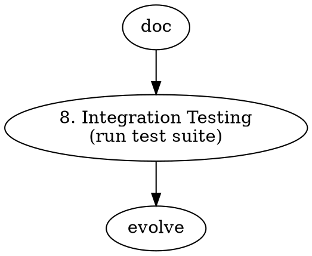

# Skill Development Guide

Patterns for extending and modifying SKILL.md.

---

## SKILL.md Structure

```markdown
---
name: github-project-researcher
description: One-line description for skill matching
---

# Title

Description of what this skill does.

**Clone Directory:** /path/to/clones

## When to Use

- Trigger condition 1
- Trigger condition 2

## Quick Start

```
User: "Research https://github.com/owner/repo"
```

## Research Workflow

```dot
digraph { ... }
```

## Step N: Title

### N.1 Sub-step

Content...

### Commands

```bash
# Command examples
```

### Output Template

```markdown
## Section

{placeholder}
```
```

---

## Workflow Steps

### Step Numbering Convention

| Number | Purpose |
|--------|---------|
| 1-3 | Core phases (fetch, clone, analyze) |
| 3.x | Analysis sub-steps (3.1, 3.2, 3.5) |
| 3.D | Documentation-specific analysis |
| 4 | Evaluation |
| 4.x | Special evaluations (4.2, 4.5) |
| 5 | Output generation |
| 6 | Knowledge base updates |
| 7 | Competitor analysis |

### Adding a New Step

1. **Add Section Header**
```markdown
## Step 8: Integration Testing

**When to Use:** After cloning, for projects with test suites.
```

2. **Add Workflow Diagram Update**


3. **Add Commands**
```bash
# Run tests
pytest tests/ -v --tb=short
npm test
go test ./...
```

4. **Add Output Template**
```markdown
## Test Results

| Suite | Passed | Failed | Coverage |
|-------|--------|--------|----------|
| Unit  | 45     | 0      | 89%      |
```

5. **Update Quick Start Examples**
```markdown
User: "Research and test https://github.com/owner/repo"  # Step 8
```

---

## Command Block Patterns

### Language Detection Pattern

```bash
# ALWAYS detect language first
find . -type f -not -path './.git/*' | sed 's/.*\.//' | sort | uniq -c | sort -rn | head -15

# Then use detected extensions
grep -r "pattern" --include="*.py" --include="*.ts" .
```

### Fallback Chain Pattern

```markdown
### Strategy A: Preferred Method

```bash
gh repo view owner/repo
```

### Strategy B: Fallback

```bash
curl -s "https://api.github.com/repos/owner/repo"
```
```

### Multi-Language Analysis Pattern

```markdown
#### Python Projects

```bash
grep -r "pattern" --include="*.py" .
```

#### JavaScript/TypeScript Projects

```bash
grep -r "pattern" --include="*.ts" --include="*.js" .
```
```

---

## Output Templates

### Research.md Section Template

```markdown
## Section Title

{Brief description of what this section covers}

### Sub-section

| Column 1 | Column 2 | Column 3 |
|----------|----------|----------|
| {data}   | {data}   | {data}   |

### Key Findings

- {Finding 1}
- {Finding 2}

{Notes or recommendations}
```

### Knowledge Base Entry Template

```markdown
## {Project Name} ({date})

**Verdict:** {one-line verdict}
**Key Insight:** {single most valuable learning}
**Reusable Pattern:** {pattern or omit}
**Deep Dive:** [{Project}]({path}/RESEARCH.md)
**Tags:** {tag1}, {tag2}
```

---

## KB Hygiene Rules

### 6.1.1 Append Minimal Entries

```markdown
## ✅ GOOD

## React (2026-01)

**Verdict:** Use — Industry standard, excellent DX.
**Key Insight:** Server Components reduce bundle size 40%.
**Deep Dive:** [→](./facebook/react/RESEARCH.md)
**Tags:** frontend, library, stable

## ❌ BAD (empty placeholders)

## SomeProject (2026-01)

**Verdict:** 
**Key Insight:** 
**Reusable Pattern:** None found
**Security:** N/A
**Community:** To be assessed
```

### 6.1.2 Compact Index Table

```markdown
## Research Index

| Date | Project | Type | Verdict | Tags | Link |
|------|---------|------|---------|------|------|
| 2026-01 | facebook/react | code | ✅ Use | frontend | [→](./facebook/react/RESEARCH.md) |
```

---

## Decision Tables

Use tables for decision logic:

```markdown
| Signal | Project Type | Route To |
|--------|-------------|----------|
| `.rst` dominates + `conf.py` | Docs Project | Step 3.D |
| `.py` dominates + `pyproject.toml` | Code Library | Step 3 |
| Both substantial | Mixed | 3.D → 3 |
```

---

## Evolution Pattern

When adding steps based on research learnings:

```markdown
This step was evolved from researching {PROJECT} where {SITUATION}.

{Explanation of what was missing and how this step addresses it.}
```

Example:
```markdown
This step was evolved from researching `realpython/python-guide` where 
code-analysis templates were forced onto a documentation-first project, 
producing irrelevant results.
```

---

## Testing Skill Changes

### Dry Run Test
```bash
./research.sh --dry-run https://github.com/example/test
```

### Quick Integration Test
```bash
# Small, fast repo
./research.sh https://github.com/octocat/Hello-World --async
```

### Full Test
```bash
# Real project with complexity
./research.sh https://github.com/python/cpython --async --timeout 7200
```

---

## Common Additions

### New Security Check

```markdown
#### {Language} Projects

```bash
# Check for {vulnerability type}
grep -r "{pattern}" --include="*.{ext}" . | grep -v ".git"
```

**What to Look For:**
- {Indicator 1}
- {Indicator 2}
```

### New Fitness Dimension

Add to Step 4 table:
```markdown
| **{New Dimension}** | {Question to answer} |
```

Add to score calculation:
```
{New Dimension}:  /10
```

### New Competitor Source

Add to Step 7.1:
```markdown
# Alternative search
gh search repos "{domain} {keyword}" --limit 20
```

---

## Recommended Tools for Skill Editing

When editing large skill files like `SKILL_FULL.md` (1600+ lines):

- **[fast-edit](https://github.com/includewudi/fast-edit)** — Specialized for large-file edits, batch modifications, and multi-file writes. Avoids timeout issues common with standard Edit/Write tools on files >500 lines.
- Prefer fast-edit over manual Edit tool for any change spanning multiple sections of SKILL_FULL.md.
